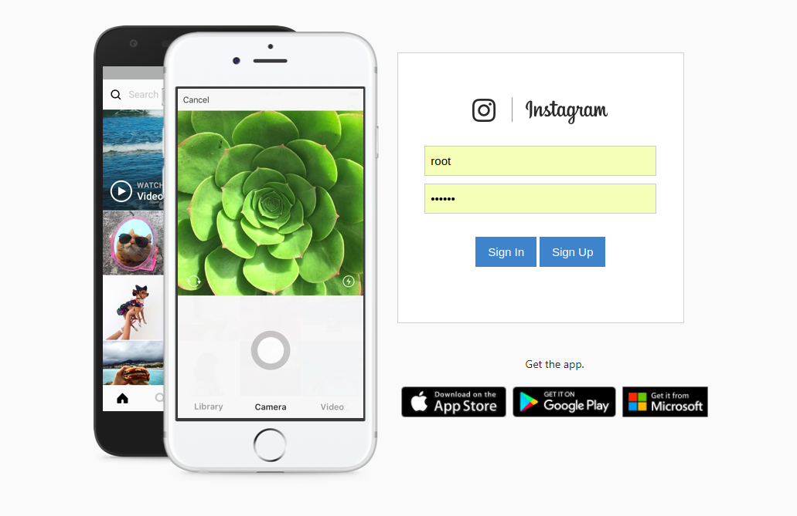
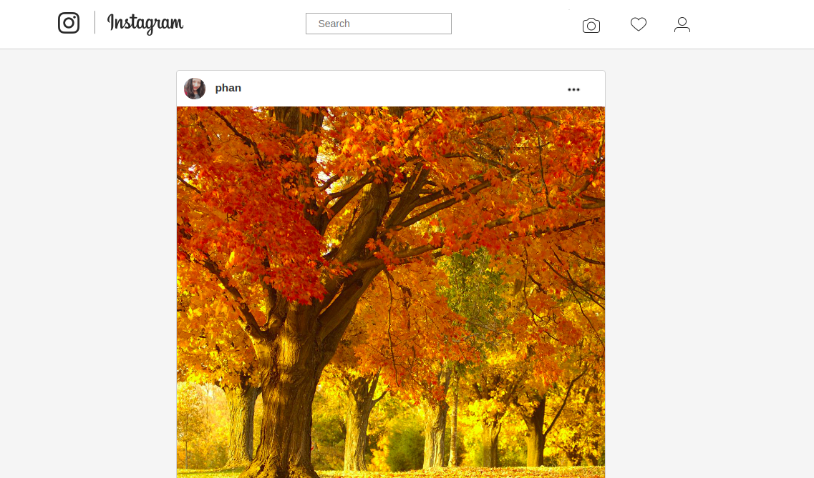
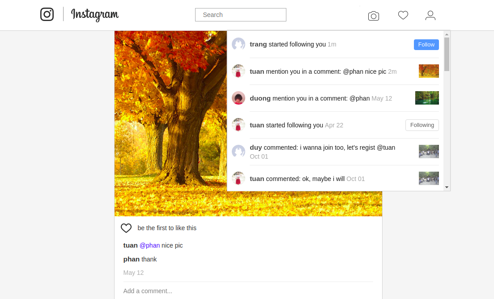
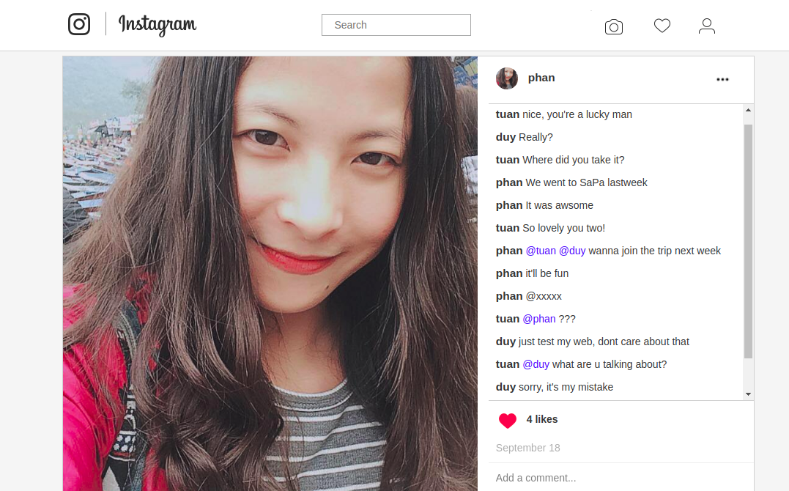
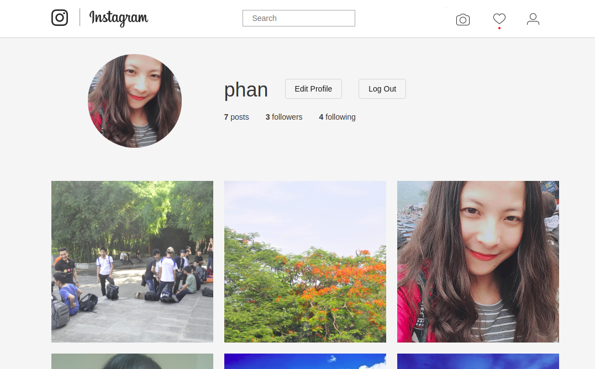

# instagram

1. INTRODUCE PROJECT

Clone www.instagram.com
- Language: PHP with no framework
- Model: Model-View-Controller (MVC)
- Realtime technique: Web Socket + Long Polling

2. DEMO PROJECT

- Login

- Home

- Notification

- Post + comment

- Profile

